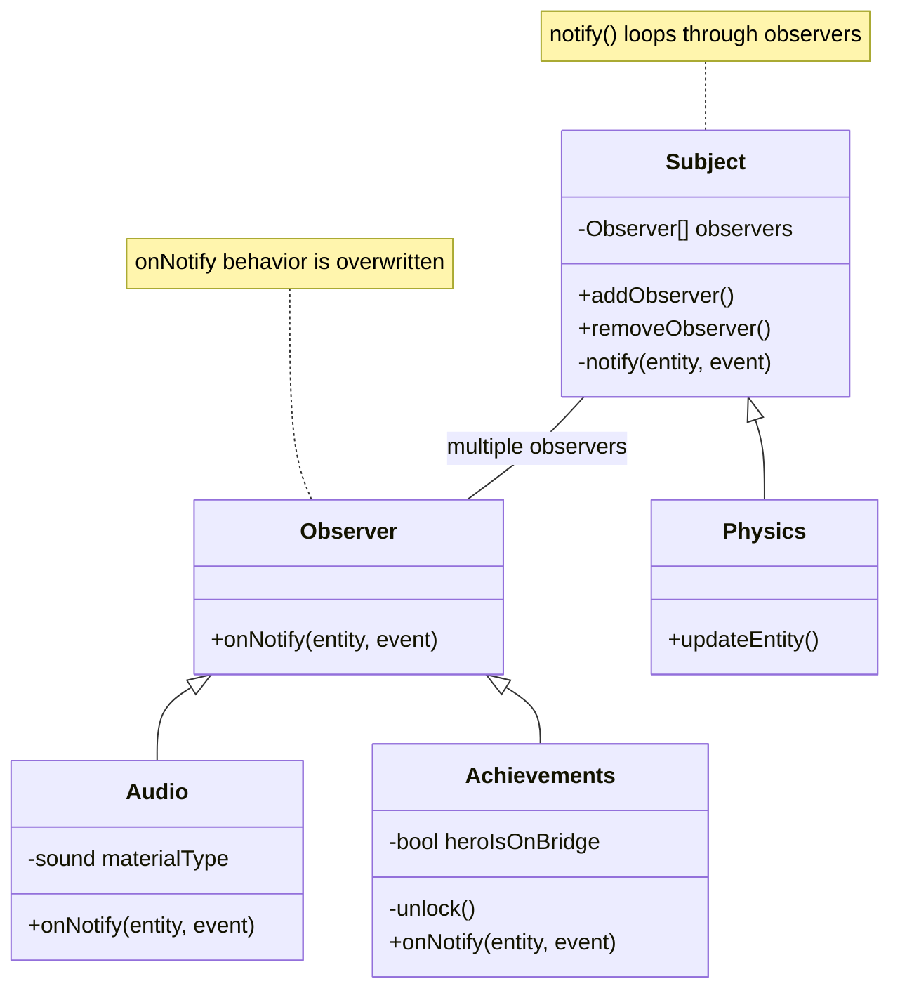

# Observer Pattern

## Intent

Allow one piece of code to notify multiple objects about any events that occur to the subject of observation

## Motivation

###

## Implemenation

```mermaid
classDiagram
    Observer <|-- Audio
    Observer <|-- Achievements
    Subject <|-- Physics
    Subject -- Observer : multiple observers

    note for Subject "notify() loops through observers"
    note for Observer "onNotify behavior is overwritten"
    class Observer{
        +onNotify(entity, event)
    }

    class Subject{
        -Observer[] observers
        +addObserver()
        +removeObserver()
        -notify(entity, event)
    }

    class Physics {
        +updateEntity()
    }

    class Achievements {
        -bool heroIsOnBridge
        -unlock()
        +onNotify(entity, event)
    }

    class Audio {
        -sound materialType
        +onNotify(entity, event)
    }

```
